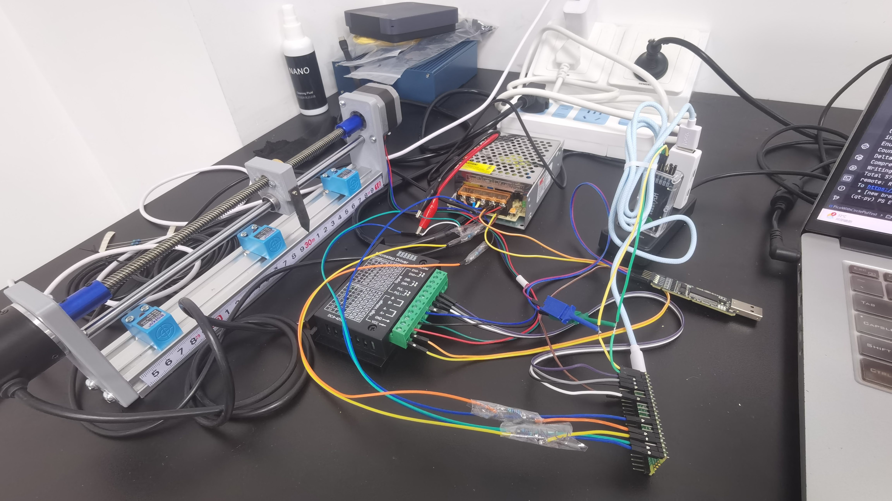

# HelloPicoWithCirclePid

## 仓库说明

- 本人的工作内容主要还是与软件相关，但在项目中总是能够看到一些硬件相关的东西
- 乘着一些项目的空档期就乘机试着串联起来一些碎片化的知识，别说自己从零复现一个知识体系还是很有挑战的，真是各种坑
- 如果要了解仓库的细节可以看一下CSDN的博客:
  1. [小白学习pid环控制-概览篇](https://blog.csdn.net/qq_34524246/article/details/150103752?spm=1001.2014.3001.5501)
     - 描述了用到了哪些的硬件，如何进行简单的驱动测试(核心部件)
        - 以及一些拆解维修
     - 这一部分对应了DriverSample
  2. [小白学习pid环控制-实现篇](https://blog.csdn.net/qq_34524246/article/details/150272075?spm=1001.2014.3001.5501)
     - 这一部分开始组装各种驱动到一起并进行闭环的控制
     - 使用了开源项目[兰博文/PID-Simulator-Web](https://pid-simulator-web.skythinker.top/)
       - 是个好东西，没有他是没动力去实现的
     - 最后形成的文件是: PicoMain.py
  3. [小白学习pid环控制-通讯篇](https://blog.csdn.net/qq_34524246/article/details/150414588?spm=1001.2014.3001.5501)
     - 这一部分开始引入了一些读写指令(之前接到过电脑横机的外包项目，按照那个灵感来的)
     - 本来想去实现G-Code，可还是对现在的知识水平来说有些复杂
     - 最后形成的文件是: PicoMainWithUART.py
  4. [小白学习pid环控制-上位机篇](https://blog.csdn.net/qq_34524246/article/details/150426507?spm=1001.2014.3001.5501)
     - 虽然Ai生成界面代码还是挺火的，但这个是全程从0开始敲的
     - 主要也是用不好这些工具，而且也需要从0踩坑毕竟是学习东西
     - 自己写完后才发现自己写通信的bug真多啊，为了稳定通信各种调参，协议分析仪是个好东西
     - 形成的上位机工程是: HelloPicoWithQt(QML真是一个好东西)
     - 形成的界面大致排布调参工程: Test/HelloPicoWithQtDesignTest

最后放一张整体的视觉图:

